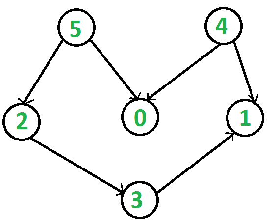

# Topological Sort – O(V+E)
> V = Number of vertices in DAG
> E = Number of edges in DAG
#### Topological sorting for Directed Acyclic Graph (DAG) is a linear ordering of vertices such that for every directed edge uv, vertex u comes before v in the ordering. Topological Sorting for a graph is not possible if the graph is not a DAG.
## Example:

#### A topological sorting of the graph of above would be `5 4 2 3 1 0`. Another valid topological sorting of the graph above is `4 5 2 3 1 0`. This maintains the invariant that for every directed edge uv, vertex u comes before v in the ordering.
