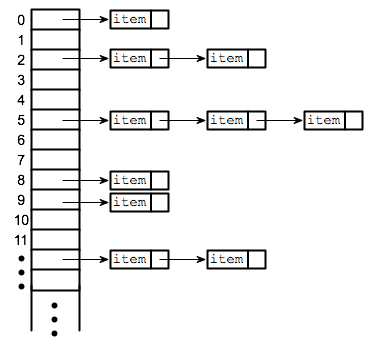

# Hashing
> A hash table is a data structure that implements an associative array abstract data type, a structure that can map keys to values. A hash table uses a hash function to compute an index into an array of buckets or slots, from which the desired value can be found.
## Hashing with chaining
> Hashing with chaining is a way of implementing a hashtable using linkedlists to handle collisions. During the insert process if a collision occurs a linkedlist is created housing the key value pairs.
> 
### Operations: m = size of hashtable, l = size of linkedlist
#### isEmpty: Tells you if hashtable is empty. – O(m)
#### hashItem(key): Takes a key and returns index by using universal hashing – O(1)
#### get(key): Takes a key and returns corrosponding value. – O(l)
#### insert(key, value): Inserts a key value pair into the hashtable. – O(1)
#### delete(key): deletes a key value pair if in hashtable. – O(l)
#### printTable: Displays all the key value pairs in the hashtable. – O(ml)
## Hashing with open addressing
> Hashing using open addressing handles collisions differently from chaining by continuesly probing the table until an open slot is found to insert key value pair.
### Operations: m = size of hashtable.
#### isEmpty: Tells you if hashtable is empty. – O(m)
#### hashItem(key, i): Takes a key and prob i then returns index by using universal hashing – O(1)
#### get(key): Takes a key and returns corrosponding value. – O(1)
#### insert(key, value): Inserts a key value pair into the hashtable. – O(1)
#### delete(key): deletes a key value pair if in hashtable. – O(1)
#### printTable: Displays all the key value pairs in the hashtable. – O(m)
